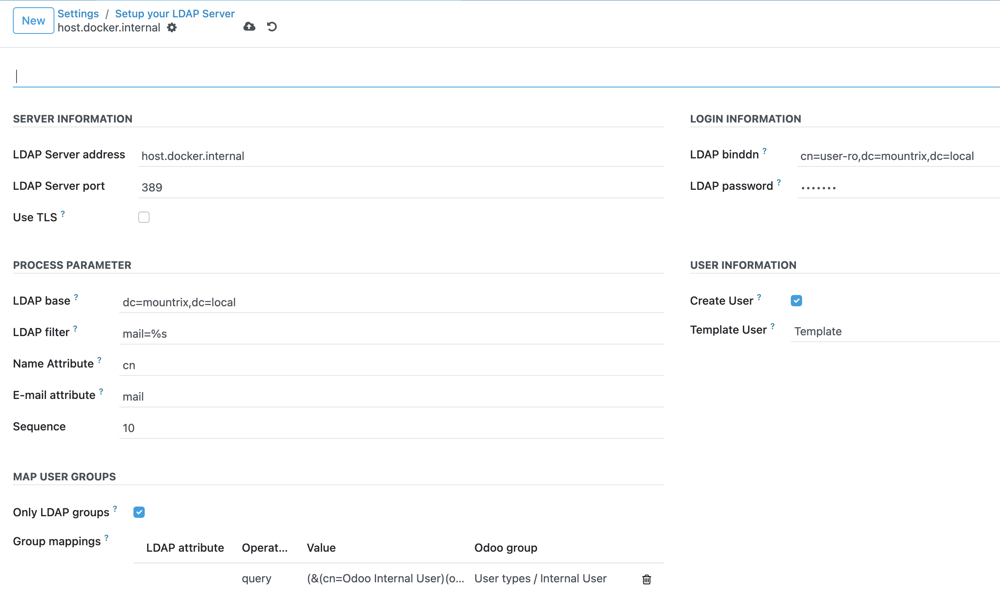

# Odoo LDAP Development Environment

[OCA server-auth](https://github.com/OCA/server-auth/tree/16.0) 

This repository is the Odoo CE project setup I used to develop LDAP cusotomisations.
Integrating OCA LDAP modules that allowed me to:
- User login using LDAP 
- Sync LDAP groups with Odoo groups
- User signature and operations confirmation using LDAP. * Not included here *


## Project Architecture

```plaintext
.
├── .vscode                     # Visual Studio Debug configuration
├── addons                      # Custom Odoo addons
├── addons_customer             # Customer-specific Odoo addons
├── addons_external             # Third-party Odoo addons
├── config                      # Odoo configuration files
├── ldap                        # LDAP demo ldif files for OU, groups and user
├── nginx                       # Nginx here to avoid issues using workers. 
├── .gitignore
├── Dockerfile                  # Odoo Dockerfile
├── bootstrap.sh                # Kubernetes startup script for Odoo
├── docker-compose.yml          # Configuration for local docker-compose runs
├── requirements.txt            # External Python libraries for Odoo
└── README.md
```


**Prerequisites**:
Install the following tools:
- Git (Only if the build is going to be performed in the environment)
- Docker
Follow the official Docker [Docker Engine](https://docs.docker.com/engine/install/) to install it on your OS.
- Docker-Compose
Follow the official Docker [Docker Compose](https://docs.docker.com/compose/install/standalone/) to install it on your OS.
- Clone Application source code:
 ```bash
  git clone git@github.com:awisky/odoo-ldap-docker.git
  ```


### Managing Containers

- **Start the container**:
The following command will start the application. Docker service must be running
  ```bash
  docker-compose up
  ```

The following command will stop the application. Docker service must be running
- **Stop the container**:
  ```bash
  docker-compose down
  ```

### Login into Odoo
It depends your env. I'm using mac, so 127.0.0.1 works for me. Try localhost on windows.
If you want to go trough Nginx use port 80, otherwise 8069 from Odo
Use the credentials set in the docker compose.

http://127.0.0.1/web/login
http://127.0.0.1:8069/web/login

### Login into Jupyter
Use the token set in the docker compose.
http://127.0.0.1/back

----

### LDAP Development Environment
The following steps are necessary to test Odoo connectivity with an LDAP server
The LDAP server initiates and has two users configured in docker compose
- user-wisky/passwisky with readonly access
- admin/passwisky with admin access


Reference:
https://github.com/osixia/docker-openldap

#### insecure access
```bash
ldap → ldapsearch -x -b "dc=mountrix,dc=local" -H ldap://ldapserver:389 -D "cn=user-wisky,dc=mountrix,dc=local" -w passwisky
```

#### Secure access
```bash
ldap → ldapsearch -x -b "dc=mountrix,dc=local" -H ldaps://ldapserver:636 -D "cn=user-wisky,dc=mountrix,dc=local" -w passwisky
```

#### Add org
```bash
ldap → ldapadd -x -H ldap://ldapserver:389 -D "cn=admin,dc=mountrix,dc=local" -w passwisky -f org.lfip
adding new entry "ou=mountrix,dc=mountrix,dc=local"
```

#### Search org
```bash
ldap → ldapsearch -x -H ldap://ldapserver:389 -D "cn=admin,dc=mountrix,dc=local" -w passwisky -b "dc=mountrix,dc=local" "(ou=mountrix)"
# extended LDIF
#
# LDAPv3
# base <dc=mountrix,dc=local> with scope subtree
# filter: (ou=mountrix)
# requesting: ALL
#

# mountrix, mountrix.local
dn: ou=mountrix,dc=mountrix,dc=local
objectClass: organizationalUnit
ou: mountrix

# search result
search: 2
result: 0 Success

# numResponses: 2
# numEntries: 1
```

#### Add user to org
```bash
ldap → ldapadd -x -H ldap://ldapserver:389 -D "cn=admin,dc=mountrix,dc=local" -w passwisky -f agustin.lfip
adding new entry "uid=agustin,ou=mountrix,dc=mountrix,dc=local"
```

#### Search user by uid
```bash
ldap → ldapsearch -x -H ldap://ldapserver:389 -D "cn=admin,dc=mountrix,dc=local" -w passwisky -b "uid=agustin,ou=mountrix,dc=mountrix,dc=local"
# extended LDIF
#
# LDAPv3
# base <uid=agustin,ou=mountrix,dc=mountrix,dc=local> with scope subtree
# filter: (uid=agustin)
# requesting: ALL
#

# agustin, mountrix, mountrix.local
dn: uid=agustin,ou=mountrix,dc=mountrix,dc=local
uid: agustin
cn: agustin
sn: 3
objectClass: top
objectClass: posixAccount
objectClass: inetOrgPerson
loginShell: /bin/bash
homeDirectory: /home/agustin
uidNumber: 16859
gidNumber: 100
gecos: agustin
userPassword:: e2NyeXB0fXg=
mail: agustinwisky@gmail.com

# search result
search: 2
result: 0 Success

# numResponses: 2
# numEntries: 1
```

#### Search by email
```bash
ldap → ldapsearch -x -H ldap://ldapserver:389 -D "cn=admin,dc=mountrix,dc=local" -w passwisky -b "dc=mountrix,dc=local" "(mail=agustinwisky@gmail.com)"
# extended LDIF
#
# LDAPv3
# base <dc=mountrix,dc=local> with scope subtree
# filter: (mail=agustinwisky@gmail.com)
# requesting: ALL
#

# agustin, mountrix, mountrix.local
dn: uid=agustin,ou=mountrix,dc=mountrix,dc=local
uid: agustin
cn: agustin
sn: 3
objectClass: top
objectClass: posixAccount
objectClass: inetOrgPerson
loginShell: /bin/bash
homeDirectory: /home/agustin
uidNumber: 16859
gidNumber: 100
gecos: agustin
userPassword:: e2NyeXB0fXg=
mail: agustinwisky@gmail.com

# search result
search: 2
result: 0 Success

# numResponses: 2
# numEntries: 1
```

#### Adding org unit
```bash
ldap → ldapadd -x -H ldap://ldapserver:389 -D "cn=admin,dc=mountrix,dc=local" -w passwisky -f ou.ldif   
adding new entry "ou=groups,dc=mountrix,dc=local"
```

#### Adding groups
```bash

ldap → ldapadd -x -H ldap://ldapserver:389 -D "cn=admin,dc=mountrix,dc=local" -w passwisky -f group.ldif 
adding new entry "cn=Odoo Internal User,ou=groups,dc=mountrix,dc=local"

```

#### Adding user to some groups
```bash
ldap → ldapadd -x -H ldap://ldapserver:389 -D "cn=admin,dc=mountrix,dc=local" -w passwisky -f agustin_groups.ldif 
modifying entry "cn=Odoo Internal User,ou=groups,dc=mountrix,dc=local"
```

#### Search groups of a member
```bash
ldapsearch -H ldap://ldapserver:389 -D "cn=admin,dc=mountrix,dc=local" -w passwisky -b "ou=groups,dc=mountrix,dc=local" "(member=uid=username,ou=users,dc=mountrix,dc=local)"
```

#### Delete group
```bash
ldapdelete -x -H ldap://ldapserver:389 -D "cn=admin,dc=mountrix,dc=local" -w passwisky "ou=groups,dc=mountrix,dc=local"
```

#### List all
```bash
ldapsearch -x -H ldap://ldapserver:389 -D "cn=admin,dc=mountrix,dc=local" -w passwisky -b "ou=groups,dc=mountrix,dc=local" -s one "(objectClass=*)"
# extended LDIF
#
# LDAPv3
# base <ou=groups,dc=mountrix,dc=local> with scope oneLevel
# filter: (objectClass=*)
# requesting: ALL
#

# Odoo Internal User, groups, mountrix.local
dn: cn=Odoo Internal User,ou=groups,dc=mountrix,dc=local
objectClass: top
objectClass: groupOfNames
cn: Odoo Internal User
description: Group for Odoo Internal
member: cn=admin,ou=users,dc=mountrix,dc=local
```

#### Verify membership of the user in a group
```bash
ldapsearch -x -H ldap://ldapserver:389 -D "cn=admin,dc=mountrix,dc=local" -w passwisky -b "ou=groups,ou=mountrix,dc=mountrix,dc=local" "(&(objectClass=groupOfNames)(member=uid=agustin,ou=users,ou=mountrix,dc=mountrix,dc=local))"
```
---

#### LDAP Group Mappings

- LDAP (with no Active Directory) 
query (&(cn=Odoo Internal User)(objectClass=groupOfNames)(member=uid=agustin,ou=users,ou=mountrix,dc=mountrix,dc=local)) => Odoo Internal User Group

- LDAP with Active Directory 
use member operation instead of query
